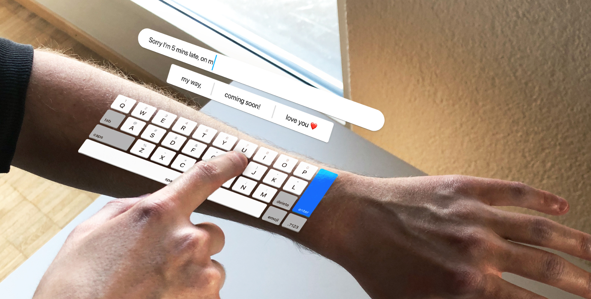

# Augmented Words

## Quick setup

1. Install all dependencies via `pnpm install`
2. Run `pnpm dev` to start the development server
3. Be sure to have the Meta Quest Developer Hub application installed
4. Open the Meta Quest Developer Hub application and connect the Meta Quest via a cable
5. Forward the local port `3000` to the Meta Quest via `adb reverse tcp:3000 tcp:3000`

### Debugging

In order to inspect the elements of the app running inside the browser of the Meta Quest or to e.g. also read the outputs of the console, you can open a Chrome browser and navigate to `chrome://inspect/#devices`. There you can find the Meta Quest and can inspect it.
